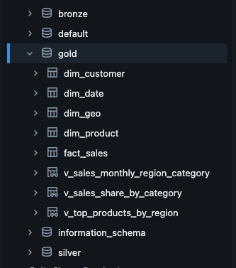

# Data Modeling

This folder contains documentation and diagrams related to **data modeling** applied in the Gold layer. The goal of the data model is to support **analytical and reporting workloads** efficiently.

## Modeling Approach

The Gold layer follows a **star schema design**, which is widely used for BI and analytics use cases.

### Key principles:
- Clear separation of **facts** and **dimensions**
- Optimized for aggregations and slicing
- Simple and intuitive relationships for BI tools

## Model Components

### Fact Table
- Stores transactional measures such as sales
- Contains foreign keys linking to dimension tables
- Designed for aggregation and trend analysis

### Dimension Tables
- Customer dimension
- Product dimension
- Geographic dimension
- Date dimension

These tables provide descriptive attributes that enrich the fact data.

## Benefits of This Model
- Efficient querying and aggregations
- Easy integration with BI tools like Power BI
- Supports common analytical questions such as:
  - Sales trends over time
  - Regional performance
  - Product and category analysis
  - Customer-level insights

