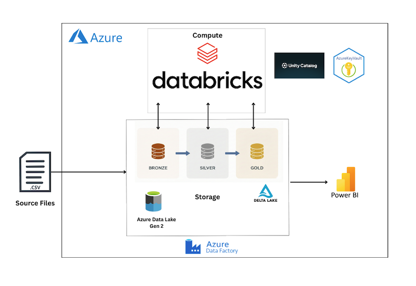

# Sales Analytics Platform using Azure Databricks Medallion Architecture

##  Project Overview
This project implements an **end-to-end data engineering and analytics pipeline** using **Azure Databricks**, **Delta Lake**, and **Azure Data Factory (ADF)**.  
The solution follows the **Medallion Architecture (Bronze → Silver → Gold)** to ingest raw data, apply transformations, perform data modeling, and produce **business-ready datasets** for analytics and visualization.

The focus of this project is on:
- Designing a scalable Medallion Architecture
- Implementing incremental and idempotent data processing
- Modeling data into analytics-friendly structures
- Orchestrating workflows using Azure Data Factory

## Dataset
**Source:** Kaggle  
**Dataset Name:** *Superstore Sales Dataset*

The dataset represents retail sales transactions for a fictional superstore and is widely used for analytics and BI use cases. It contains:

- Order and shipment details
- Customer information
- Product categories and sub-categories
- Geographic attributes (region, state, city)
- Sales metrics

## Architecture Summary
The solution follows a layered architecture:

Raw CSV (ADLS Gen2) -> Bronze Layer (Raw ingestion) -> Silver Layer (Cleaned & standardized data) -> Gold Layer (Modeled data for analytics) -> Curated outputs for BI & reporting

Each layer is implemented as a **separate Databricks notebook**, ensuring clear separation of responsibilities and maintainability.

##  Medallion Architecture (High Level)

### Bronze Layer
- Raw ingestion of source data from Azure Data Lake
- Minimal transformation
- Metadata enrichment

### Silver Layer
- Data cleaning and standardization
- Type casting and deduplication
- Incremental processing using Delta Lake MERGE

### Gold Layer
- Analytics-ready datasets
- Business-level aggregations
- Optimized for reporting and visualization

> **Detailed implementation for each layer is available in the `Notebooks/` folder.**

## Data Modeling
The Gold layer applies **data modeling techniques** to structure the data for analytics use cases.

- Fact tables capture transactional measures
- Dimension tables provide descriptive attributes
- The model is designed to support efficient slicing, filtering, and aggregation

> **Detailed data model diagrams and explanations are available in the `data_modeling/` folder.**

## Orchestration with Azure Data Factory
Azure Data Factory is used to orchestrate the pipeline execution.

Key orchestration features:
- File availability checks using **Get Metadata**
- Conditional execution using **If Condition**
- Sequential execution of Databricks notebooks (Bronze → Silver → Gold)

This ensures controlled, repeatable, and automated pipeline execution.

## Analytics & Visualization
The curated **Gold-layer datasets** are designed to be directly consumed inBI tool **Power BI** for reporting and analysis.

- Gold fact and dimension tables support interactive filtering and slicing
- Business-focused views simplify dashboard creation
- Aggregated datasets enable analysis of sales trends, regional performance, and product-level insights

## Key Outcomes
- Built an end-to-end data pipeline using the Medallion Architecture on Azure Databricks
- Transformed raw retail sales data into clean, structured, analytics-ready datasets
- Applied data modeling techniques to organize data into fact and dimension tables
- Orchestrated the pipeline execution using Azure Data Factory
- Enabled sales reporting and insight generation using Power BI

